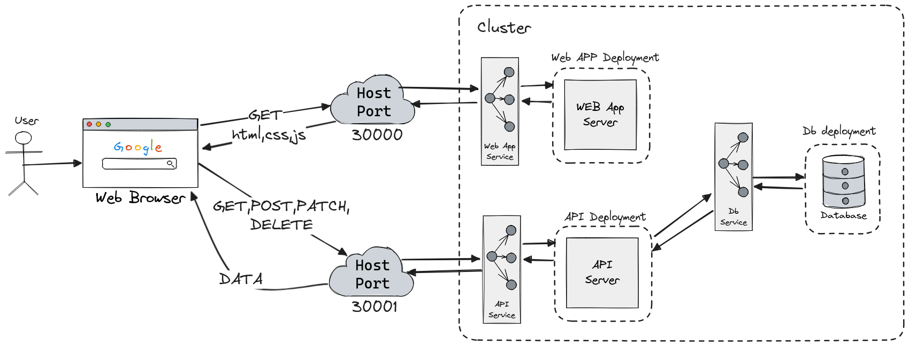

# Deploy kubernetes

A simple TO-DO application used for learning about container orchestration, deploy and scaling in Kubernetes.

## 0. System Design


## 1. Build the Docker images
```bash
cd api/db && \
docker build -t todo-db:v1.0 . && \
cd .. && \
docker build -t todo-api:v1.0 . && \
cd ../web && \
docker build -t todo-web:v1.0 .
```

## 2. Kubernetes In Docker (KIND)
### 2.1. Create cluster
```kind create cluster --config todo-cluster.yaml```

### 2.2 Load docker images in kind
```bash
kind load docker-image todo-db:v1.0 && \
kind load docker-image todo-api:v1.0 && \
kind load docker-image todo-web:v1.0
```

## 3. Kubernetes
### 3.1 Deploy the Database, API and WEB frontend on kubernetes
```bash
cd api/db && \
kubectl apply -f db-deployment.yaml && \
cd .. && \
kubectl apply -f api-deployment.yaml && \
cd ../web && \
kubectl apply -f web-deployment.yaml
```
